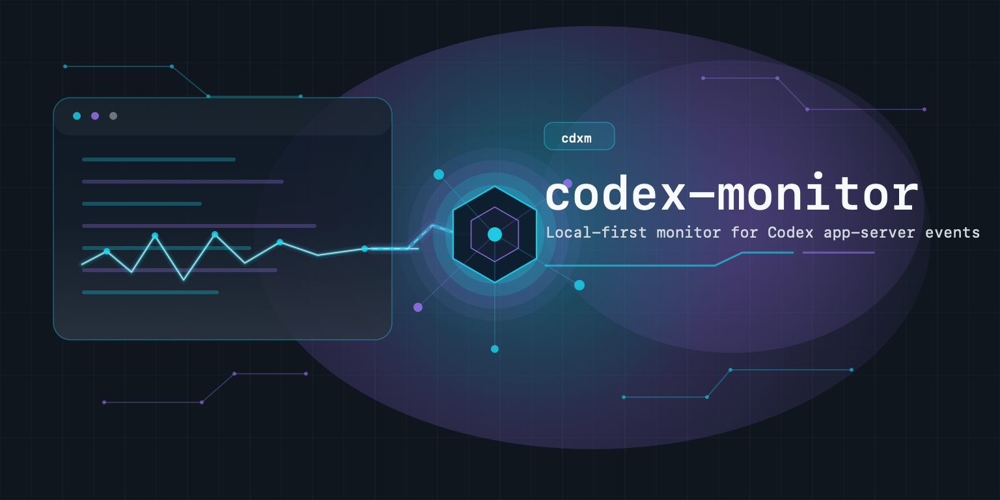

# codex-monitor

<p align="center">
  
</p>

`codex-monitor` is a local-first monitor for delivering external events into
the Codex App / Codex app-server control plane.

The preferred short alias binary is `cdxm`.

## Install for daily use

### macOS / Linux

One-liner install:

```bash
curl -fsSL https://raw.githubusercontent.com/lucianlamp/codex-monitor/main/install.sh | bash
```

The installer asks before each user-visible step:

- install `cdxm` and `codex-monitor` under `$HOME/.codex-monitor/bin`
- install the Codex skill under `$HOME/.codex/skills/codex-monitor`
- optionally install a Codex CLI shim at `$HOME/.agents/bin/codex`
- add `$HOME/.codex-monitor/bin` and `$HOME/.agents/bin` to PATH in `~/.zshrc`

The Codex shim prompt defaults to no. If `$HOME/.agents/bin/codex` already
exists, the installer leaves it untouched unless you explicitly request the
shim (`--install-shim`); in that case it reports the detected kind, keeps a
backup of the previous entrypoint (`codex.bak-<timestamp>`), and installs the
codex-monitor shim.

From this repository, the equivalent local install is:

```bash
./install.sh
```

### Windows native PowerShell

Windows is supported with a native PowerShell installer (no WSL). The
`cdxm`/`codex-monitor` binaries are native; the optional Codex shim runs the
same bash shim used on macOS/Linux through Git Bash, so installing that shim
requires Git Bash:

```powershell
iwr https://raw.githubusercontent.com/lucianlamp/codex-monitor/main/install.ps1 -UseBasicParsing | iex
```

From this repository, the equivalent local install is:

```powershell
powershell -ExecutionPolicy Bypass -File .\install.ps1
```

The Windows installer asks before each user-visible step:

- install `cdxm.exe` and `codex-monitor.exe` under
  `%USERPROFILE%\.codex-monitor\bin`
- install the Codex skill under
  `%USERPROFILE%\.codex\skills\codex-monitor`
- optionally install a Codex CLI shim at `%USERPROFILE%\.agents\bin\codex.cmd`
  (a thin launcher that runs the shared bash shim through Git Bash)
- add `%USERPROFILE%\.codex-monitor\bin` and
  `%USERPROFILE%\.agents\bin` to the user PATH

The Codex shim prompt defaults to no. If `codex.cmd` already exists, the
installer leaves it untouched unless you explicitly request the shim
(`-InstallShim`); in that case it reports the detected kind, keeps a backup of
the previous entrypoint (`codex.cmd.bak-<timestamp>`), and installs the
codex-monitor shim.

Because native `agmsg watch` reads SQLite through bundled `rusqlite`, building
from source on Windows requires the Rust MSVC toolchain plus MSVC Build Tools.

For a non-interactive install with the shim:

```powershell
powershell -ExecutionPolicy Bypass -File .\install.ps1 -Yes -InstallShim
```

For a local source install without touching the Codex shim:

```powershell
powershell -ExecutionPolicy Bypass -File .\install.ps1 -Source . -NoShim
```

To make the Windows Codex App and `cdxm` share the exact same app-server,
enable the reversible App bridge and restart Codex App:

```powershell
powershell -ExecutionPolicy Bypass -File .\install.ps1 -Yes -NoShim -NoPath -InstallAppBridge -Source .
```

The installer preserves prior user-level `CODEX_CLI_PATH` and
`CDXM_REAL_CODEX` values. By default it selects the installed Codex App bundle
before older per-user CLI copies. It copies the App-bundled Codex executable to
`~/.codex-monitor/runtime/codex-app-real.exe` and copies its matching
`codex-code-mode-host.exe`, command runner, and Windows sandbox setup beside it,
because WindowsApps package executables cannot be launched directly by the
external bridge and Codex resolves those helpers as sibling files. An explicit
`-RealCodexPath` must point to a directory containing
`codex-code-mode-host.exe`. Rerun the bridge install after a Codex App update.
To restore the prior environment:

```powershell
powershell -ExecutionPolicy Bypass -File .\install.ps1 -Yes -NoShim -NoPath -SkipBuild -RemoveAppBridge -Source .
```

On Windows, `--target app` accepts only a live `codex-app-bridge` marker. It
does not treat an ordinary Codex CLI app-server process as Codex App. Verify
after the restart with `cdxm targets` and `cdxm --target app loaded`. Generic
bridge-proxied `app-server --listen stdio://` processes do not publish App
markers, so tooling-owned servers cannot make the App target ambiguous.

For development-only binary refresh:

```bash
cargo install --path . --bins --force --debug
```

This installs `codex-monitor` and `cdxm` into Cargo's bin directory, usually:

```text
$HOME/.cargo/bin/cdxm
```

Confirm it is available:

```bash
command -v cdxm
cdxm --help
```

If `command -v cdxm` prints nothing, add Cargo's bin directory to your shell
PATH:

```bash
export PATH="$HOME/.cargo/bin:$PATH"
```

After changing this repository's source code, rerun the install command to
refresh the installed binaries.

For an optimized binary, omit `--debug`. The optimized install can take much
longer on macOS because the bundled SQLite dependency is compiled with release
optimizations.

### Codex CLI entrypoint

For daily Codex CLI monitoring, start interactive CLI sessions through a shim
that makes them app-server-bound. The common local setup is the agmsg-compatible
Codex shim at:

```text
$HOME/.agents/bin/codex
```

Put that directory before the real Codex binary on PATH:

```bash
export PATH="$HOME/.agents/bin:$PATH"
type -a codex
```

The first `codex` should be a shim. It may be an existing agmsg shim or the CDXM
shim installed by `install.sh`; the important property for `codex-monitor` is
that interactive `codex` launches are routed through app-server/`--remote`.
Without a shim or an explicit `codex --remote ...`, a plain real-Codex TUI
process is not a reliable live injection target for `cdxm`.

## Daily flow

List auto-discovered Codex App / Codex CLI app-server endpoints:

```bash
cdxm targets
```

For an already-loaded thread, `cdxm` can usually attach automatically by cwd.
Query the loaded thread for a working directory:

```bash
cdxm threads --cwd /path/to/project
```

Start foreground monitor delivery into the loaded thread for that cwd, using
agmsg as the input adapter:

```bash
cdxm monitor watch agmsg --team <team> --name <agent> --cwd /path/to/project
```

The `cdxm agmsg watch ...` command remains as a source-specific shortcut for
the same adapter.

Stop the watcher with `Ctrl-C`.

## Commands

```bash
cdxm targets
cdxm threads --cwd <path>
cdxm send --cwd <path> --text <msg>
cdxm send --cwd <path> --text <msg> --mode start --wait
cdxm send --thread <id> --mode steer --turn <turn-id> --text <msg>
cdxm monitor watch agmsg --team <team> --name <agent> --cwd <path> --dry-run
cdxm monitor watch agmsg --team <team> --name <agent> --cwd <path>
cdxm agmsg doctor --team <team> --name <agent> --cwd <path>
cdxm agmsg watch --team <team> --name <agent> --cwd <path> --dry-run
cdxm agmsg watch --team <team> --name <agent> --cwd <path>
cdxm agmsg launch-agent install --team <team> --name <agent> --cwd <path>
cdxm agmsg launch-agent status --team <team> --name <agent>
cdxm remote doctor
cdxm remote connect --max-messages 1
```

Debug commands such as `loaded`, `steer`, and low-level
`remote ...` recovery commands still exist. Most are hidden from help and are
not the daily command surface; `remote connect` is visible as an explicit
remote-control client probe.

## Targets

Default target is `auto`.

`auto` discovers live Codex endpoints from:

- `CDXM_ENDPOINT`, `CODEX_MONITOR_ENDPOINT`, or
  `CODEX_APP_SERVER_ENDPOINT`
- the Codex App control socket
- live `codex --remote ...`, `codex app-server --listen ...`, and
  agmsg Codex bridge processes

For cwd-based commands, such as `threads --cwd`, `send --cwd`, and
`monitor watch <adapter> --cwd`, auto probes candidate endpoints with
`thread/loaded/list` plus `thread/list` and chooses the live endpoint where a
thread for that cwd is already loaded. If no live endpoint has that cwd loaded,
commands that need a thread safely fall back to managed mode only when managed
can resolve a unique matching thread.

For commands with an explicit `--thread`, such as `send` and
`monitor watch <adapter>`, auto probes candidate endpoints with
`thread/loaded/list` and
chooses the one where the thread is already loaded. This avoids `thread/resume`
and prevents the resume/fork failure mode.

List candidates:

```bash
cdxm targets
```

If auto is ambiguous, pass `--endpoint` or `--target` explicitly.

Hidden diagnostic command `loaded` is endpoint-scoped. If `cdxm loaded` is
ambiguous because several live endpoints are present, use `cdxm targets` and
rerun with `--target app`, `--target managed`, or `--endpoint <url>`.

Managed mode starts an isolated loopback app-server at `ws://127.0.0.1:<port>`:
most daily commands do not need this mode explicitly.

Existing app-server control daemon attach is explicit:

```bash
cdxm --target app threads --cwd <path>
cdxm --target app send --cwd <path> --text <msg>
cdxm --target app remote doctor
```

On Unix, `--target app` connects to:

```text
$HOME/.codex/app-server-control/app-server-control.sock
```

On Windows, `--target app` discovers the loopback WebSocket listener published
by the installed Codex App bridge. It refuses ordinary CLI app-server
processes. If several live bridge endpoints exist, use `--endpoint` to select
one explicitly.

`--endpoint ws://127.0.0.1:<port>` connects to an explicit loopback WebSocket.
`--endpoint unix:///path/to/app-server.sock` connects to an explicit Unix
WebSocket app-server socket.
`--endpoint stdio://` starts an isolated stdio app-server.

## Existing Thread Send

`cdxm send` delivers text as app-server user input. The default mode is `auto`:
it reads the loaded thread, uses `turn/steer` when an active `inProgress` turn
is visible, and otherwise falls back to `turn/start`.

By default the command returns after the app-server acknowledges the
`turn/steer` or `turn/start` request. It does not wait for `turn/completed`,
which avoids deadlocks when using `cdxm` to inject into the same live Codex App
thread that is controlling the command.

Use `--wait` only when the caller really needs synchronous completion:

```bash
cdxm --target app send --thread <id> --text <msg> --mode start --wait
```

Use `--mode start` to force a new turn. Use `--mode steer --turn <turn-id>` to
force steering into a known active turn:

```bash
cdxm --target app send --thread <id> --mode steer --turn <turn-id> --text <msg>
```

When `--target app`, `--endpoint`, or auto-resolved live endpoints are used,
`send` first checks `thread/loaded/list` and refuses unloaded threads. It still
does not call `thread/resume`. The hidden `steer` command uses the
same loaded-thread guard.

## Remote Control Diagnostics

`cdxm remote ...` talks to the Codex app-server remote-control RPC surface. This
is the same local control plane used to expose this computer as a remote-control
environment for other Codex clients.

Use `remote doctor` as the primary visible command. It diagnoses the
remote-control surfaces without changing account or device state:

```bash
cdxm --target app remote doctor
```

`remote doctor` prints tab-separated `doctor` rows for each independent surface:

- `app-server-status`: local app-server remote-control state.
- `app-server-clients`: clients returned by local app-server
  `remoteControl/client/list`.
- `auth-refresh` and `auth-file`: local ChatGPT auth refresh/read status.
- `backend-clients`: clients returned by ChatGPT backend
  `/wham/remote/control/clients`.
- `local-enrollment`: enrolled controller client and device-key id found in the
  local Codex global state file.
- `device-key`: whether the local native device-key module can read the
  enrolled public key.
- `device-key-next`: repair guidance when the local controller enrollment is
  stale, missing, mismatched, or unsupported.

The command is intentionally non-destructive. It does not revoke clients,
delete enrollments, edit Codex App state, sign out, or reset device keys.

Use `remote connect` as the explicit probe for making cdxm behave like an
enrolled remote-control controller client, similar to the phone-side transport:

```bash
cdxm --target app remote connect --max-messages 1
```

This connects to the remote-control websocket with the local enrolled client and
device key, prints the proof algorithm, and optionally prints observed messages.
It does not yet open or select a Codex thread by itself. If it fails with
`device key not found`, `remote doctor` will emit
`doctor<TAB>device-key-next<TAB>repair-local-controller-enrollment`. That state
requires Codex App Settings remote-control re-authorization before `cdxm` can act
like the phone; `cdxm` should not silently recreate controller device keys.

If Codex App settings says it cannot load the device list while a phone can
still remote-control this Mac, run `remote doctor`. The settings UI combines
the backend client list with the local app-server client list, so a failure in
either read path can break the settings list even when an already-paired phone
connection remains usable. A stale or missing local Mac controller key appears
as `doctor<TAB>device-key<TAB>warn<TAB>...<TAB>unavailable`; that explains why
this Mac cannot act as a controller client, but it does not by itself prove the
phone side is broken.

Hidden advanced recovery commands remain available for explicit troubleshooting:
`remote status`, `remote clients`, `remote monitor`, `remote enable`,
`remote disable`, `remote pair-start`, `remote pair-status`, and `remote claim`.

## Monitor Adapters

`cdxm monitor` is the generic receive surface. A monitor adapter converts an
external event stream into `BridgeEvent` records; the monitor core resolves the
loaded Codex thread, sends the event with `turn/start` or `turn/steer`, and
advances adapter state only after app-server acknowledgement.

The core boundary is:

- thread detection: find a loaded Codex App / Codex CLI app-server thread by
  cwd or explicit thread id, without implicitly calling `thread/resume`
- source adapter: poll an external event source, expose monotonically ordered
  `BridgeEvent` records, and format each event as Codex turn input
- delivery: send formatted input with the selected `auto`, `start`, or `steer`
  mode and advance the adapter cursor only after app-server ack

Current adapter:

```bash
cdxm monitor watch agmsg --team dev --name sally --cwd /path/to/project
```

`cdxm agmsg watch ...` is kept as a source-specific shortcut for the agmsg adapter.

## agmsg Adapter

Start agmsg monitor work with a read-only runtime snapshot:

```bash
~/.codex/skills/codex-monitor/scripts/cdxm-context.sh /path/to/project <team> <agent>
```

The agmsg adapter reads the message store directly and does not use Codex
shims, PATH replacement, `inbox.sh`, or `watch.sh`. CLI sessions still need to
be app-server-bound before `codex-monitor` can inject into them; for daily use,
the standard entrypoint is a PATH-first `codex` shim as described above.
The adapter only polls unread inbox rows where `read_at IS NULL`; previously
read history is ignored even when the codex-monitor cursor state is empty.
The SQLite adapter is enabled on macOS, Linux, and native Windows builds. On
Windows, use the native PowerShell installer and Codex CLI shim for
app-server-bound Codex sessions; `agmsg watch` reads the same SQLite message DB
through bundled `rusqlite`.

Default agmsg DB:

```text
$HOME/.agents/skills/agmsg/db/messages.db
```

On native Windows, the default resolves through `HOME` when present, otherwise
`USERPROFILE`:

```text
%USERPROFILE%\.agents\skills\agmsg\db\messages.db
```

Use the current working directory as the target thread selector:

```bash
cdxm monitor watch agmsg --team dev --name sally
cdxm agmsg watch --team dev --name sally
```

Or pass a cwd explicitly:

```bash
cdxm monitor watch agmsg --team dev --name sally --cwd /path/to/project
cdxm agmsg watch --team dev --name sally --cwd /path/to/project
```

Pin a loaded thread id, or override the agmsg DB:

```bash
cdxm monitor watch agmsg --team dev --name sally --thread <loaded-thread-id> --agmsg-db /path/to/messages.db
cdxm agmsg watch --team dev --name sally --thread <loaded-thread-id> --agmsg-db /path/to/messages.db
```

Before installing or starting a long-running watcher, inspect the full routing
surface:

```bash
cdxm agmsg doctor --team dev --name sally --cwd /path/to/project
```

`agmsg doctor` prints tab-separated `doctor` rows for discovered targets,
matching loaded threads, the `agmsg:<team>:<name>` saved-state key and id,
latest inbox ids, target and same-team LaunchAgents with log mtimes, active
agmsg consumer processes, and an explicit ack-vs-visible note.

Preview one delivery plan without sending a turn or marking state:

```bash
cdxm monitor watch agmsg --team dev --name sally --cwd /path/to/project --dry-run
cdxm agmsg watch --team dev --name sally --cwd /path/to/project --dry-run
```

Dry-run delivery rows are source-agnostic. They include `source`, `cursor`,
`event_id`, and adapter metadata such as `agmsg_id`, `team`, `recipient`, and
`sender`.

With the default `--target auto`, `agmsg watch` first tries to attach to a
discovered live endpoint where the cwd or `<loaded-thread-id>` is already
loaded. For a specific Codex App session use `--target app`; for a specific
Codex CLI session use the socket from `cdxm targets`:

```bash
cdxm --endpoint unix:///path/to/codex-app-server.sock agmsg watch --team dev --name sally --thread <loaded-thread-id>
```

Delivery uses the same non-waiting auto send path as `cdxm send`: if the loaded
thread has an active in-progress turn it calls `turn/steer`, otherwise it calls
`turn/start`. In both cases the agmsg row is marked seen after the app-server
acknowledges the request; `agmsg watch` does not wait for `turn/completed`.
Use `--mode start`, `--mode steer`, or `--mode auto` to make delivery behavior
explicit during diagnosis.

App-server ack and codex-monitor state advancement mean the app-server accepted the
delivery. They do not prove that the current Codex UI rendered a visible
message. Treat live smoke as two checks: codex-monitor state/inbox advancement, and a
separate visible `agmsg monitor event` in the intended loaded thread.

### macOS LaunchAgent

For a durable local monitor bridge, install a per-user LaunchAgent. This writes
a plist under `$HOME/Library/LaunchAgents` and logs under
`$HOME/Library/Logs/codex-monitor`.

Preview the plist:

```bash
cdxm agmsg launch-agent print --team dev --name sally --cwd /path/to/project
```

Install without starting:

```bash
cdxm agmsg launch-agent install --team dev --name sally --cwd /path/to/project
```

Install and start immediately:

```bash
cdxm agmsg launch-agent install --team dev --name sally --cwd /path/to/project --force --load
```

Check or remove it:

```bash
cdxm agmsg launch-agent status --team dev --name sally
cdxm agmsg launch-agent uninstall --team dev --name sally
```

The LaunchAgent label is stable per team/name, for example
`com.local.codex-monitor.agmsg.dev.sally`. Reinstall with `--force` to
change cwd, endpoint, or DB settings. If multiple agents share a team, choose
the exact `--name`; do not install a second watcher for a role that already has
another bridge delivering the same inbox.

`launch-agent status` includes stdout/stderr log paths, mtimes, desired thread,
active thread, and `args_match`. This makes stale launchd ProgramArguments
visible instead of hiding them behind `installed=true loaded=true`.

## Safety

- codex-monitor never auto-approves Codex app-server requests.
- codex-monitor refuses non-loopback WebSocket endpoints in the MVP.
- `thread/inject_items` is not the default delivery path.
- `--target app` does not start, stop, or replace the app-server control daemon.
- live-target `send`, its hidden `steer` command, and
  `monitor watch <adapter>` refuse to call `thread/resume`; the target thread
  must already be loaded in that app-server.

## License

Licensed under the [MIT License](LICENSE).
